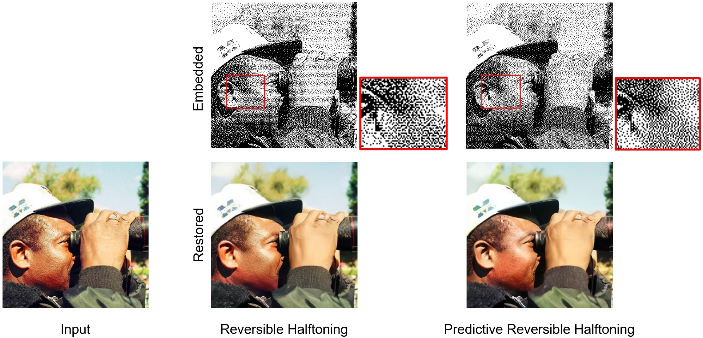

# Taming Reversible Halftoning via Predictive Luminance

### [TVCG paper](https://ieeexplore.ieee.org/abstract/document/10131911) | [Project Site](https://nicholaslck.github.io/predreshalf/) | [BibTex](#citation)

> **Note**
> This is the official implementation of the paper [Taming Reversible Halftoning via Predictive Luminance](https://ieeexplore.ieee.org/abstract/document/10131911).


Traditional halftoning usually drops colors when dithering images with binary dots, which makes it difficult to recover the original color information. We proposed a novel halftoning technique that converts a color image into a binary halftone with full restorability to its original version. [Original reversible halftoning](https://github.com/MenghanXia/ReversibleHalftoning) technique suffers from the trade-off between the blue-noise quality and the restoration accuracy. We tackle the conflicts between the blue-noise quality and restoration accuracy via a predictor-embedded approach to offload predictable information from the network, which in our case is the luminance information resembling from the halftone pattern. Such an approach allows the network to gain more flexibility to produce halftones with better blue-noise quality without compromising the restoration quality.



## Setup

```bash
conda create --name predinvthalf python=3.8

conda activate predinvthalf

pip install -r requirements.txt
```

## Prepare Dataset

1. Go to [VOC2012](http://host.robots.ox.ac.uk/pascal/VOC/voc2012/index.html#devkit) and download the training/validation dataset

2. Unzip the dataset to `dataset/voc2012`

3. Run
```bash
cd dataset/HalftoneVOC2012

python genImageSet.py
python genSpecialSet.py
python getIndexList.py
```

## Download the pretrained weight

1. Download the [pretrained weight here](https://mycuhk-my.sharepoint.com/:u:/g/personal/1155049139_link_cuhk_edu_hk/ESPaBx_14LFFv0x18fVU0igBGamfNaxpGuH4faLs7iMGmw?e=ZL4Pgr) and put it under `checkpoints/`

2. Unzip the archive file.

## Training & Inference

```bash
# stage 1 training
python train2_stage1.py -c configs/train2_stage1.yml

# stage 2 training (finetune predictor)
python train2_stage2.py -c configs/train2_stage2.yml

# Resume 
python train2_stage1.py -r <path to checkpoint>

# Inference
python inference_single.py \
--input [path to image (.png)] \
--out_dir [output directory] \
--method 'ours'
```

## Citation

If any part of our paper or code is helpful to your work, please generously cite with:
```bibtex
@article{lau2023taming,
  title={Taming Reversible Halftoning via Predictive Luminance},
  author={Lau, Cheuk-Kit and Xia, Menghan and Wong, Tien-Tsin},
  journal={IEEE Transactions on Visualization and Computer Graphics},
  year={2023},
  publisher={IEEE},
  doi={10.1109/TVCG.2023.3278691}
}
```
